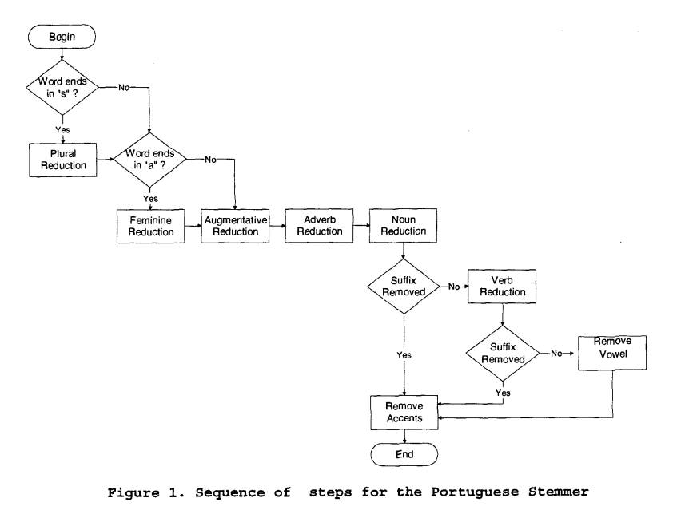

<!-- README.md is generated from README.Rmd. Please edit that file -->

```{r, echo = FALSE}
knitr::opts_chunk$set(
  collapse = TRUE,
  comment = "#>",
  fig.path = "README-"
)
```

# RSLP
> Removedor de Sufixos da Língua Portuguesa

[](https://travis-ci.org/dfalbel/rslp)
[](https://codecov.io/gh/dfalbel/rslp)

This package uses the algorithm *Stemming Algorithm for the Portuguese Language* described in [this article](http://homes.dcc.ufba.br/~dclaro/download/mate04/Artigo%20Erick.pdf) by Viviane Moreira Orengo and Christian Huyck.

The idea of the stemmer is very well explained in the following schema.



## Installing

To install the package you can use the following:

```{r, eval=FALSE}
devtools::install_github("dfalbel/rslp")
```

## Using

The only important function of the package is the `rslp` function.
You can call it on a vector of characters like this:

```{r}
library(rslp)
words <- c("balões", "aviões", "avião", "gostou", "gosto", "gostaram")
rslp(words)
```


